# GDAL camera viewshed workflow model

This document models the workflow implemented by
`scripts/gdal-camera-viewsheds.py`. The launchers open
`scripts/gdal-viewshed-gui.py`, which validates the selected paths and passes
the run settings to the processing script.

## Process model

```mermaid
flowchart TD
    sites[Camera sites GeoJSON] --> prepare[Validate inputs and configuration]
    dems[Source DEM GeoTIFFs] --> vrt[Build or reuse source DEM VRT]
    boundary[Oregon and Washington boundary] --> clipPrep[Project and validate clip boundary]
    settings[Run settings] --> prepare
    qgis[QGIS-bundled GDAL and Processing tools] --> prepare
    prepare --> hashes[Calculate analysis and web configuration hashes]
    hashes --> vrt
    prepare --> clipPrep
    vrt --> cameras{For each selected camera}
    clipPrep --> cameras

    cameras --> height{Camera height available?}
    height -- No --> skipped[Write skipped_missing_height state]
    height -- Yes --> reusable{Reusable analysis state?}
    reusable -- No --> observer[Transform observer to local UTM]
    observer --> dem[Warp and crop aligned 10 m DEM]
    dem --> viewshed[Calculate binary GDAL viewshed]
    viewshed --> rasterCheck[Validate raster and record statistics]
    reusable -- Yes --> rasterReuse[Reuse validated 10 m raster]

    rasterCheck --> exact{Exact polygons enabled?}
    rasterReuse --> exact
    exact -- Yes --> exactFlow[Mask, polygonize, dissolve, project, validate]
    exact -- No --> webReuse
    exactFlow --> webReuse{Reusable web output?}
    webReuse -- Yes --> state[Write or retain completed state]
    webReuse -- No --> webGrid[Resample to web grid with nearest neighbor]
    webGrid --> majority[Optional 3x3 majority filter]
    majority --> sieve[Optional small-patch sieve]
    sieve --> polygonize[Polygonize and dissolve in EPSG:5070]
    polygonize --> simplify[Optional topology-preserving simplification]
    simplify --> smooth[Optional Chaikin vector smoothing]
    smooth --> clip[Optional Oregon and Washington clip]
    clip --> webExport[Make valid and export RFC 7946 GeoJSON]
    webExport --> webCheck[Validate web geometry]
    webCheck --> state

    state --> combineExact[Combine exact camera polygons]
    skipped --> combineExact
    state --> combineWeb[Combine and validate web camera polygons]
    skipped --> combineWeb
    combineWeb --> union[Dissolve one non-overlapping coverage feature]
    union --> review[Build two-layer review GeoPackage]
    review --> sources[Export individual and coverage GeoJSON sources]
    sources --> tippecanoe{Tippecanoe available?}
    tippecanoe -- Yes --> mbtiles[Build and validate zoom 5-12 MBTiles]
    tippecanoe -- No --> noTiles[Retain GeoJSON and review outputs]
    combineExact --> manifest[Write manifest and failures report]
    mbtiles --> manifest
    noTiles --> manifest
```

## Inputs

| Input | Default | Purpose |
| --- | --- | --- |
| Camera sites | `data/sites.geojson` | Point locations, camera names, IDs, aliases, and mounting heights |
| Elevation models | `data/dems/*.tif` | Terrain used to calculate line-of-sight visibility |
| Clip boundary | `data/or-wa-boundary.geojson` | Restricts web display geometry to Oregon and Washington |
| QGIS installation | Auto-discovered or `OWDCIC_QGIS_ROOT` | Supplies GDAL, PROJ, `ogr2ogr`, `ogrinfo`, and `qgis_process` |
| Output directory | `outputs/gdal_viewsheds` | Stores persistent analysis, web, state, and publishing products |

The camera input must be a GeoJSON `FeatureCollection` of points. Each processed
camera needs a `cameraHeightFt` value and must fall in NAD83 UTM zone 10 or 11.
A camera without a height is recorded as skipped and does not produce geometry.

## Processing settings

| Setting | Default | Function |
| --- | ---: | --- |
| Camera set | Pilot | Runs one pilot camera, three validation cameras, all production cameras, or explicit CLI names |
| Maximum distance | 20 miles | Limits DEM extraction and viewshed range |
| Analysis cell size | 10 m | Resolution of the retained scientific viewshed raster |
| Web polygon grid | 50 m | Downsampled display grid used to limit web geometry complexity |
| Web simplify tolerance | 25 m | Removes unnecessary polygon vertices in projected metres |
| Web smoothing passes | 1 | Applies Chaikin corner cutting to web polygons; `0` disables it |
| 3x3 majority filter | Enabled | Marks a web cell visible when at least five cells in its neighborhood are visible |
| Minimum web patch cells | 0 | Runs an 8-connected sieve above zero; `0` preserves all patches |
| Oregon/Washington clip | Enabled | Clips after smoothing so the shared state boundary remains unchanged |
| Exact polygons | Enabled | Creates unsmoothed 10 m EPSG:5070 polygons for analysis and review |
| Keep working DEMs | Disabled | Retains per-camera intermediate files when enabled |
| Overwrite | Disabled | Rebuilds all selected stages instead of using compatible state files |

The majority filter, simplification, and Chaikin smoothing affect only web
display products. They do not change the retained 10 m raster or exact polygon.
Each additional smoothing pass increases vertex count and processing cost.

## Per-camera products

| Product | Location | Description |
| --- | --- | --- |
| Viewshed raster | `rasters_10m/<site_stem>.tif` | Binary 10 m visibility result in the camera's local UTM CRS |
| Exact polygon | `polygons_exact/<site_stem>.gpkg` | Dissolved, unsmoothed EPSG:5070 geometry |
| Web polygon | `web/<viewshed-id>.geojson` | Filtered, simplified, smoothed, clipped RFC 7946 geometry |
| Resume state | `state/<site_stem>.json` | Status, hashes, statistics, filter summary, and output paths |
| Intermediates | `work/<site_stem>/` | Temporary DEM, mask, polygon, and smoothing files when retained |

## Combined and publishing products

| Product | Layer or contents | Purpose |
| --- | --- | --- |
| `camera_viewsheds_exact_epsg5070.gpkg` | `camera_viewsheds` | Combined exact camera polygons for analysis |
| `mapbox/camera_viewsheds_web_epsg5070.gpkg` | `camera_viewsheds`, `camera_viewshed_coverage` | Projected QGIS review package |
| `mapbox/camera-viewsheds.geojson` | Individual camera features | Preserves `viewshed_id` for camera highlighting |
| `mapbox/camera-viewshed-coverage.geojson` | One dissolved coverage feature | Prevents overlapping blue fills from increasing opacity |
| `mapbox/camera-viewsheds-z5.mbtiles` | Both web source layers, zooms 5-12 | Uploadable Mapbox vector-tile package |
| `viewshed-manifest.json` | Configuration, products, and camera entries | Connects generated geometry to stable camera IDs |
| `analysis_config.json` | Current settings and hashes | Controls safe reuse on later runs |
| `failures.json` | Per-camera failures | Records cameras that could not complete |

Tippecanoe is optional. If it is unavailable, the GeoJSON and review GeoPackage
remain usable, but no MBTiles file is produced.

## Resumability model

The workflow uses two principal hashes:

| Hash | Inputs | Invalidates |
| --- | --- | --- |
| Analysis hash | Sites file, DEM inventory, radius, 10 m cell size, refraction coefficient | Viewshed raster, exact polygon, and all downstream web products |
| Web hash | Analysis hash, web resolution, simplification, smoothing, majority filter, sieve, and clipping configuration | Web polygon and combined publishing products only |

A stage is reusable only when its state is complete, its required hash matches,
and its output file exists. Changing smoothing or another web-only option reuses
the expensive 10 m raster and exact polygon. Enabling **Overwrite** disables all
per-camera reuse.

Combined web products are rebuilt from the completed per-camera GeoJSON files
on every run. The combined exact GeoPackage can be reused when the analysis hash
and expected feature count still match.

## Validation and failure behavior

- Rasters must contain visible cells and only the expected visibility range.
- Vector outputs are checked with SQLite `ST_IsValid`; reprojection and export
  steps apply `-makevalid` where geometry can change.
- The combined individual layer must contain one feature per web input.
- Dissolved coverage must contain exactly one feature.
- MBTiles metadata must contain both expected source layers and zooms 5-12.
- Per-camera failures normally allow later cameras to continue; `--fail-fast`
  stops at the first one.
- Cancellation terminates the active subprocess and returns exit code `130`.
- Completed state files remain available for the next resumable run.
- Camera or packaging failures return exit code `1`; a clean run returns `0`.

## Primary implementation

| Responsibility | Implementation |
| --- | --- |
| GUI, settings, launch, and progress | `scripts/gdal-viewshed-gui.py` |
| Analysis, geometry, resume, and packaging pipeline | `scripts/gdal-camera-viewsheds.py` |
| Cross-platform QGIS/GDAL discovery | `scripts/qgis_runtime.py` |
| QGIS review project generation | `scripts/build-qgis-viewshed-project.py` |
| macOS launcher | `Run GDAL Viewsheds.command` |
| Windows launcher | `Run GDAL Viewsheds.bat` |
